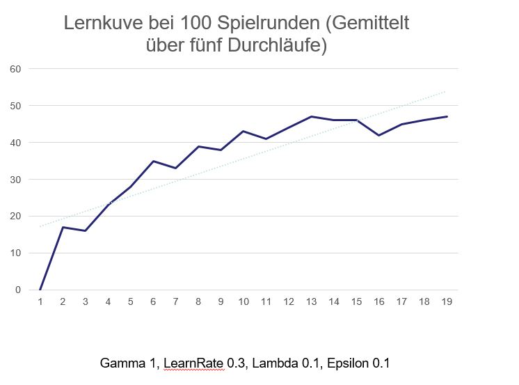
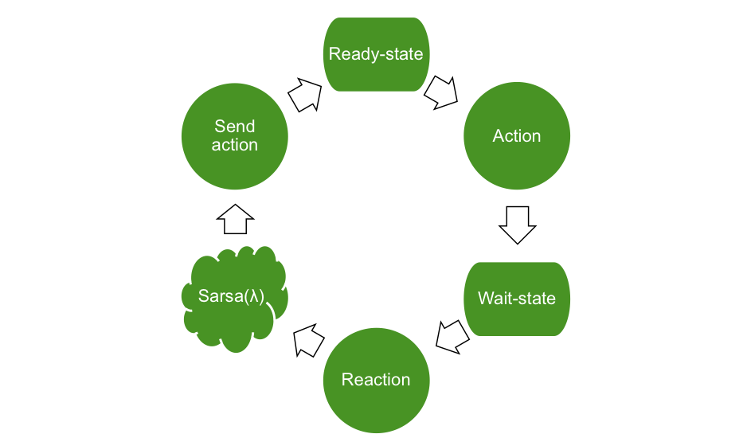

# Das Problem

Die Grundidee ist ein virtueller Roboter, welches vom User am Leben gehalten werden muss, indem dieser die Bedürfnisse des Roboters befriedigt. Dies geschieht in Form von gezielten User-Aktionen, welche jeweils auf ein bestimmtes Bedürfnis abzielen. Der Roboter muss durch eigene Aktionen auf seine Bedürfnisse aufmerksam machen, was zur Folge hat, dass der User dieses Verhalten interpretieren und eine neue Aktionen auswählen muss.

Die Bedürfnisse umfassen Öl, Aufmerksamkeit und Störung. Die erste Implementierung des Zustandraumes sah zudem noch Liebe und Energie als Bedürfnisse vor, welche aber in der finalen Version keine Verwendung mehr fanden, da der Zustandraum für den Lerner zu groß gewesen wäre.

Schlussendlich lernt der Agent das Mapping von einer eigenen Aktion auf ein bestimmtes Bedürfnis. Der Lernerfolg hängt zudem stark davon ab, wie gut und wie schnell der User das Verhalten des Agenten versteht und die richtigen Aktionen zur Befriedigung der Bedürfnisse ausführt.

# Modellierung

## Agent, Umgebung und Zustandsraum

Was gehört bei Ihrer Modellierung zum Agenten und in welcher Umgebung befindet sich dieser?
* Der Agent befindet sich im zweidimensionalen Raum und kann nur die Nutzeraktionen wahrnehmen und darauf reagieren.
* Der Agent versucht möglichst lange zu überleben indem er den reward maximiert
* Der Agent kann Aktionen ausführen um die Aufmerksamkeit des Nutzers zu bekommen und ändert dadurch seinen eigenen Zustand
* Deterministische Reaktion/Reward aus der Umgebung
* Stationäres Problem (Agent will überleben)

Wie wird der Zustandsraum aufgespannt?
* Ölstand - High oder low
* Aufmerksamkeit - High oder low
* Störung - True oder False

&rarr; Daraus ergeben sich 8 mögliche Zustände

Wie haben Sie das Problem vereinfacht?
* Ölstand und Aufmerksamkeit ursprünglich auf einer Intervalskala von 0 bis 100 &rarr; wurde auf zwei Klassen aufgeteilt
* Die Zustände Liebe und Energie wurden komplett entfernt

Welche Merkmale gibt es?
* Die Merkmale sind Ölstand, Aufmerksamkeit und Störung
* Die Merkmale sind nicht sichtbar

## Aktionen

Der Agent verfügt über vier Aktionen, unter/zwischen denen er wählen kann:

* Schlafen
* Ölfleck machen
* Winken
* Störung anzeigen.  

**Mögliches Mapping**

Schlafen: Die Bedürfnisse des Agenten sind alle im optimalen bzw. in einem akzeptablen Bereich. Der Agent ist somit nicht gezwungen den User auf ein bestimmtes Bedürfnis aufmerksam zu machen und wählt im optimal Fall diese Aktion aus.

Ölfleck machen: Der Agent ist im Bedürfnis Ölstand auf einem kritischen Level und versucht den User mit dieser Aktion darauf aufmerksam zu machen.

Winken: Das Bedürfnis Aufmerksamkeit hat ein niedriges Level erreicht, der Agent versucht durch das Winken den User darauf aufmerksam zu machen.

Störung anzeigen: Der Agent zeigt dem User eine Störung an, damit jener diese beheben soll.

## Belohnungsfunktion

Der Reward setzt sich aus der Aktion des Users (Reaktion) und dem vom Agenten im Vorlauf befindlichen Zustands (Previous Condition) zusammen.

Das heißt, bemerkt der Agent, dass z.B. sein Ölstand niedrig ist, signalisiert dies mit der "Ölfleck machen" Aktion und der User interpretiert dieses Verhalten richtig, indem er die User-Aktion "Öl geben" ausführt, so bekommt der Agent einen positiven Reward, da er gelernt hat seinen Zustand sinnvoll den Nutzer zeigen und der User die für das Bedürfnis richtige Reaktion ausgeführt hat.

* Ölstand niedrig und 'Öl geben' --> +30 Reward
* Ölstand niedrig und 'Ball werfen' --> -30 Reward

Analog dazu funktioniert die Belohnungsfunktion für die Aufmerksamkeit. Hat der Roboter eine Störung muss diese behoben werden, da sonst jede andere Aktion außer 'Reparieren' zu einem negativen Reward führt ungeachtet dessen ob der Ölstand oder die Aufmerksamkeit niedrig ist.

# Algorithmen und initiale Simulation

Welchen Algorithmus benutzen Sie?
* Im Projekt wird der Sarsa-Lambda Algorithmus verwendet.

Warum?
* Es ist ein on-policy Algorithmus und daher sinnvoll für die Problemstellung
* Schneller Lernfortschritt durch Evaluierung seiner Strategie nach jedem Schritt
* Gute Erfahrungen mit dem Sarsa-Labda in der Übung

Was wären plausible Alternativen?
* Sinnvoll sind alle weiteren on-policy Algorithmen wie zum Beispiel dem normalen Q-Learning Algorithmus.

Mit welchen Parameterwerten (Lernrate, Diskontwert, etc.) haben Sie Ihre initiale Simulation durchgeführt und was haben Sie sich davon versprochen?
* Ursprüngliche wurde eine sehr hohe Exploration-Rate (0.4) gewählt, dass die Lernkurve im Verlauf zu sehr geschwankt ist -> um am Anfang ein besseres Ergebnis zu erzielen wurden initiale Q-Werte für ein sinnvolles mapping gesetzt.
* Um ein sehr schnelles Lernen zu ermöglichen (und den Nutzer nicht zu langweilen) wurde die Lernrate auf 0.8 gesetzt. Das Ergebnis ist aber suboptimal, da der Nutzer immer wieder explorativ neue Aktionen ausprobiert.

Welche anderen Belegungen haben Sie im Projekt festgelegt?
* Lambda 0.1
* Epsilon 0.1
* Gamma 1
* LearnRate 0.3

Das Plot zeigt die Lernkurve mit einem konsistenten Nutzer (der nach dem sinnvollen mapping agiert).

# Der Prototyp

Der Prototyp ist eine Webapplikation, bestehend aus einem Node.JS Server und einem HTML5, CSS, JavaScript Frontend. Die Animationen des Agenten und die User Interaktion werden im Frontend realisiert.

Der Lernalgorithmus wiederum wird auf dem Server ausgeführt, welcher per Websocket mit dem Frontend kommuniziert. Dabei empfängt der Server die Reaktion des Users (Frontend &rarr; Backend) und versendet die neue Aktion des Agenten an das Frontend (Backend &rarr; Frontend). Die folgende Abbildung veranschaulicht diesen Workflow nochmals:

Der Prototyp kann lokal mit Node.JS ausgeführt werden oder direkt auf https://virtual-r2d2.herokuapp.com/ [STAND 17.02.2018]

# Ergebnis

Entsprechen die Lernergebnisse Ihren Erwartungen?
* Grundsätzlich funktioniert das Lernen mit dem initialen Werten sehr gut und rasch (siehe Plot).

Ist Ihr System so nutzbar und wie schnell lernt es im Rahmen echter Nutzerinteraktion?
* Der Agent gerät schnell in den kritischen Zustand (und in Folge Tod), wenn der Nutzer eine zeitlang seine Bedürfnisse missinterpretiert
* Mit dem echten Nutzer stirbt der Agent oft, da er sich zunächst sehr explorativ verhält und das genaue Ziel des Spiels anfangs nicht ersichtlich ist
* Wenn der Nutzer länger spielt kann er ein mapping lernen und konsistenter spielen
