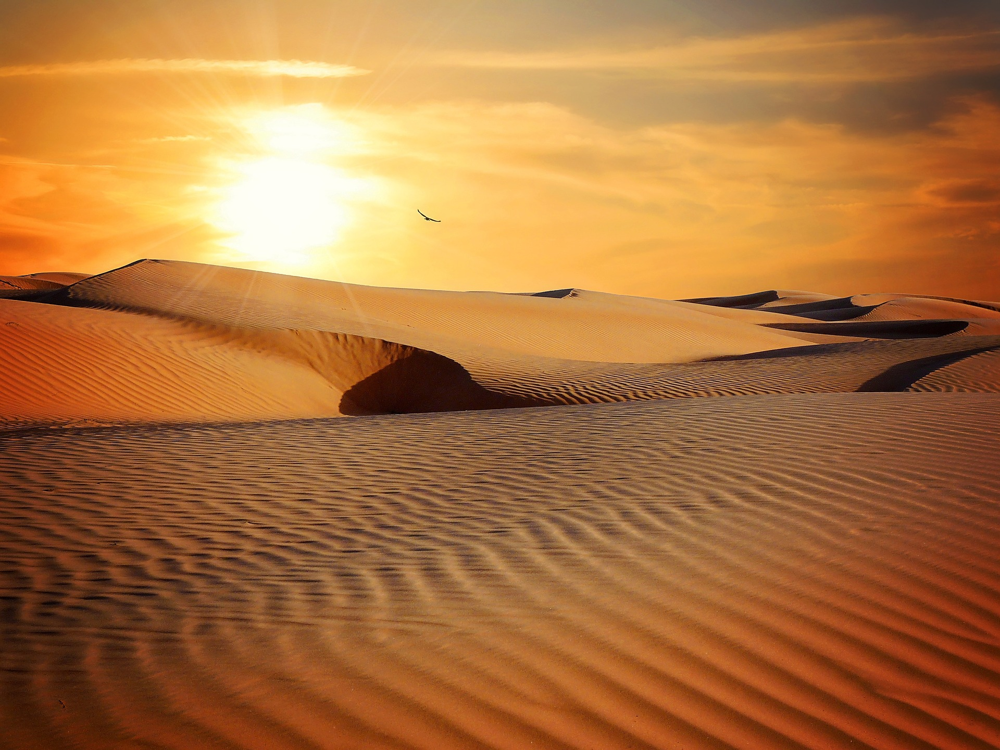

# Images

##desert.jpg
* <https://pixabay.com/de/w%C3%BCste-trockenheit-ausgetrocknet-279862/> 
* License: CC0 Creative Commons Lizenz

 
 ##sand.jpg
* <https://pixabay.com/de/w%C3%BCste-sand-landschaft-sonne-790640/>
* License: CC0 Creative Commons Lizenz

 ##star_wras.jpg
* <https://pixabay.com/de/roboter-planet-mond-weltall-2256814/>
* License: CC0 Creative Commons Lizenz
 
 
# Sounds

##Robot_blip.mp3
* <http://soundbible.com/1669-Robot-Blip-2.html>
* License: Attribution 3.0

 ##Bleep.mp3
 * <http://soundbible.com/1252-Bleep.html>
 * License: Attribution 3.0

## Bleeping.mp3
* <http://soundbible.com/701-Beep-2.html>
* License: Sampling Plus 1.0 

## Splash.mp3
* <http://soundbible.com/1097-Slime-Splash.html>
 * License: Attribution 3.0
 
# Robot CSS
* <https://github.com/tsnolan23/Pure-CSS-R2D2>
* License: ??

